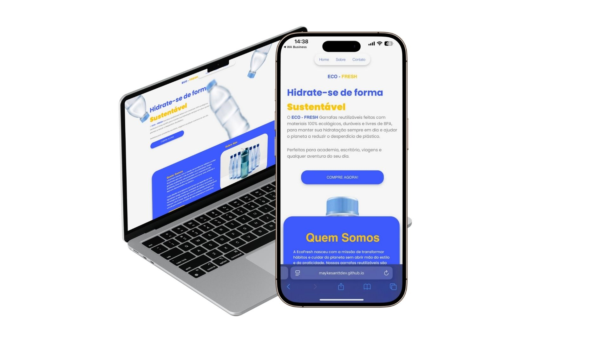

# 🌱 EcoFresh Landing Page

Landing page fictícia criada para treinar **HTML** e **CSS**, simulando o site de uma marca de garrafas reutilizáveis e sustentáveis.

---

## 📸 Prévia do Projeto
  

---

## 🎯 Objetivo
Este projeto foi desenvolvido como um **exercício prático** para:
- Aplicar HTML semântico
- Trabalhar com estilização em CSS
- Criar layouts responsivos
- Preparar terreno para implementação futura de funcionalidades em JavaScript

---

## 📂 Estrutura do Projeto
- `index.html` → Estrutura HTML da página
- `style.css` → Arquivo de estilização
- `assets/` → Pasta para imagens, ícones e outros arquivos

---

## 🖥️ Seções do Projeto
1. **Header** – Menu de navegação  
2. **Hero** – Título, subtítulo e botão de ação  
3. **Sobre** – Apresentação da marca EcoFresh  

## 🚀 Tecnologias Utilizadas
- HTML5
- CSS3
- *(JavaScript - opcional para futuras melhorias)*

---